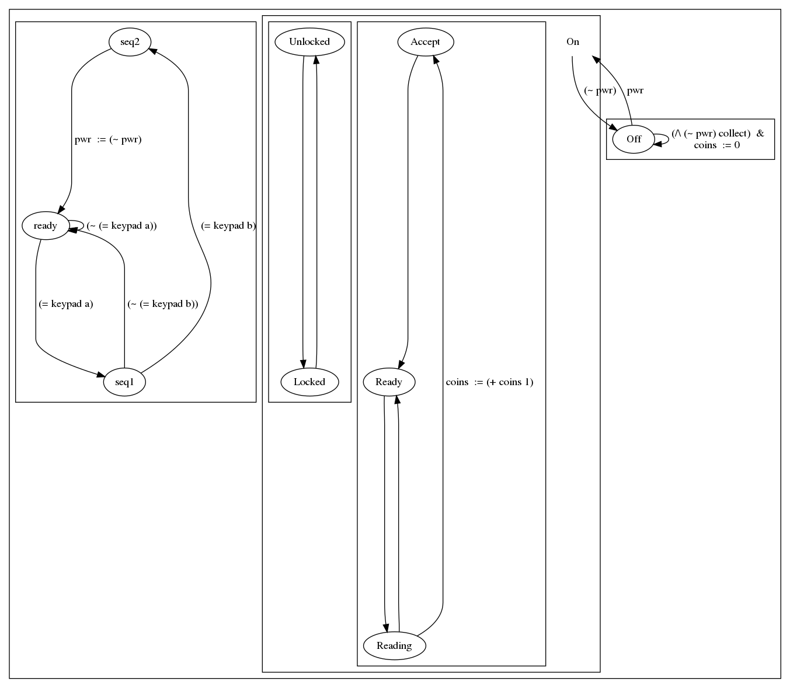

# Must Go semantics

QSpec includes constraints on inner transitions for every state such that if any of the 
transitions out of that state are possible (specifically guards) then the inner 
transition isn't allowed.

The motivation for these semantics is the ability to enable signalling using variables 
without resorting to asynchronous queues.

## Example



Consider the turnstile example above. When the keypad on the left is used to toggle the power 
off, we may wish the turnstile (on the right) to exit the `On` state immediately and not accept coins afterward.
In a standard asynchronous semantics this signal can be ignored by the turnstile machine but 
with the "must go" semantics the machine acts immediately on the information that `pwr` is false.

The full qspec model for this the modified turnstile is available [here](turnstile.qspec).

## Formal semantics

The proof that the QSpec semantics supports this behavior is Lemma `qspec_base_must_go` 
in `$PROJECT_ROOT/coq/src/Semantics/Spec.v`. Here we give description of the definitions.

Here we use `t` to represent transitions and we elide the fact that transitions here 
are guards. In other words `t : Env -> Prop` but we leave out the environment argument 
for the sake of simplicty. 

So for all states `s` in a given machine we define the "must go" inner transition 
as:

```
~ exist t in outer_transitions(s), t
  <=> ~ (\/ { t | t in outer_transitions })  (quantification over finit set)
  <=> ~ (t1 \/ ... \/ tn)                    (expansion)
  <=> ~ t1 /\ ... /\ ~ tn                    (negation)
```

### Guards vs Actions 

Note that we only include the guards (predicates on the environment before a
step) of outgoing transitions, but what are effects of ignoring the actions
(predicates on the environment before *and* after a step).

The practical result is that the machine may deadlock. To see why, first 
note that if there are only guards on the outgoing transitions then the
conjunction of the outgoing edges and the "must go" inner transition is 
total. In other words either the guard on one of the outgoing edges will 
be true or the "must go" inner transition will be true. 

Now consider the case where the guards of an outgoing transition are true,
thus implying that the "must go" inner transition is false, but there is 
also an action which is false. The transition that would be possible 
only considering guards is now impossible and the machine deadlocks since 
it can't stay in the state using the inner transition.

### QSpec definitions 

At the time of this writing the definitions that enable this behavior 
appear as follows in the QSpec denotational semantics:

```
~ (any_prop (List.map (match_trans s e1 e2) outer_trans)) 
```

Where `s` is an arbitrary state, `e1` and `e2` are transitions environments,
`any_prop` constructs a disjunction over, `(List.map (match_trans s e1 e2) outer_trans)`,
which is transitions out of `s` for the given environments. Note that we use 
map here because `match_trans` produces a false value when the source of the transition 
does not match `s`. 

