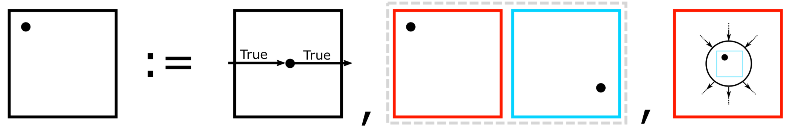
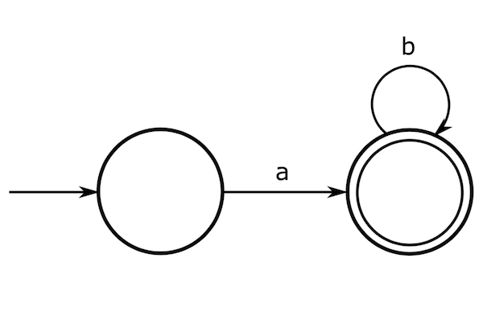
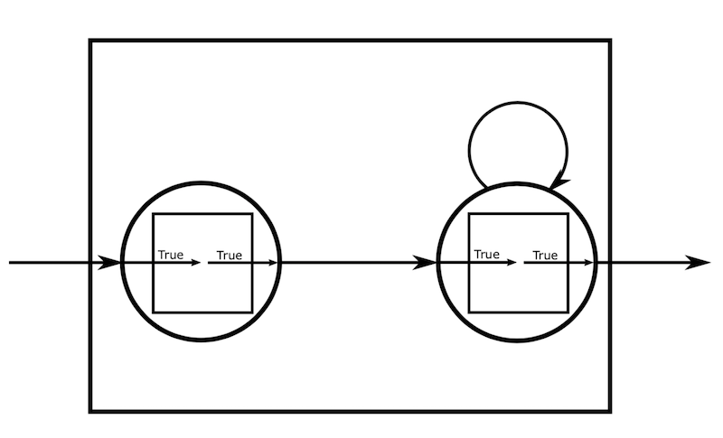
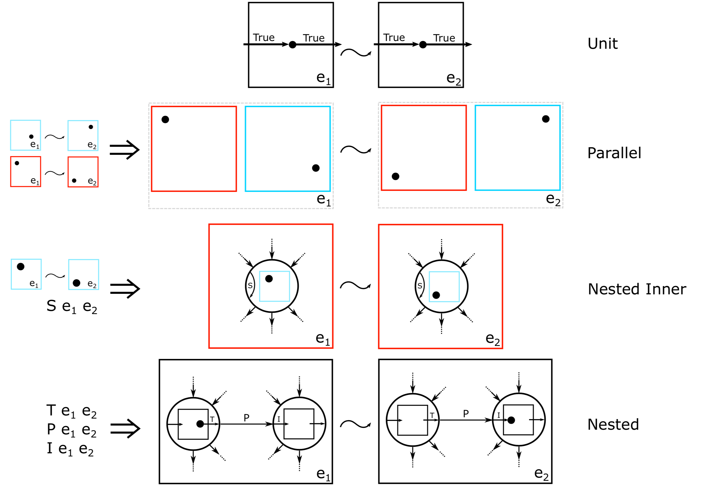
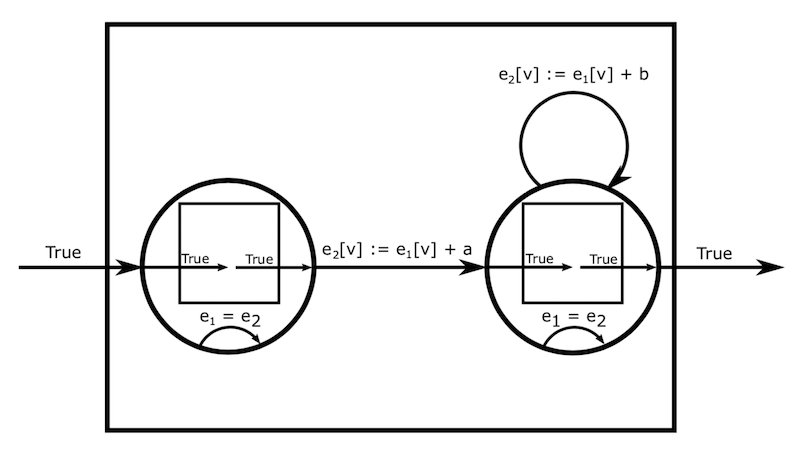

# QSpec by way of the core semantics

  - each section has three parts 
  - intuitive definitions (using images)
  - examples 
  - formal definitions 

# Core semantics

We will start by defining the syntax and semantics at the heart of QQ. Conceptually the 
charts defined here are the intermediate language for the QQ compiler. 

## Syntax

A QQ chart is constructed from three syntactic elements: the unit chart,
two charts composed in parallel, or a chart with a state machine nested 
inside of it where each of its child states has its own child chart. The dots 
in each chart represent the state machine's current position. 



Consider the example of a classic state machine that generates
all strings starting with `a` and ending with any number of `b`s.



To represent this in the syntax of QQ we need a nested chart and unit 
charts for each node in the state machine.



The initial state is denoted by an initial transition into the chart and the
terminal state is denoted by a terminal transition out of the chart. We leave
the edges unlabeled for now since we haven't defined the semantics for labeled
transitions between states.

## Semantics 

The semantics of QQ charts are defined in terms of a relation between states.
States are defined as pairs of a configuration and an environment. The
configuration, denoted by the dot in each chart, represents the position inside
a chart (or positions in a pair of charts in the case of parallel composition).
The environment, denoted by `e1` and `e2`, is an arbitrary object, but normally
this is mapping from variables to values.



We will consider each rule in turn. 

The unit chart is the chaos machine. Without any additional constraints the unit
chart can change the environment in an arbitrary manner without the
configuration moving to a different state.

Two charts composed in parallel can step when their child charts step together. Note, 
that this is a synchronous semantics. 

Charts with state machines nested in them can step in one of two ways. First, the
state machine may "sit still" and allow a chart nested in the machine's current state 
to take a step.
Note that the transition of the child chart is subject to a constraint `S` which 
is defined with the machine.
In our classic state machine we haven't defined `S` and the child charts are the unit machine. 
Thus, without some extra constraint in `S`, the machine can step to any environment 
while sitting in the initial state. That is, without `S`, any chart in QQ is 
the chaos machine!



Here we have augmented our classic state machine example with an `S` for each
state that says the environment can't change, `e1 = e2`. So any step where the machine
stays still results in the same configuration and environment. Otherwise
stay steps could change any information stored in the environment, like 
the current string being generated, to anything at all because the child
unit chart can change the environment in an arbitrary way.

The second way a nested chart can step is that the state machine may transition
between states subject to the constraint `P`. In the process the machine must
transition out of the child chart of the first state (terminal constraint `T`)
and into the child chart of the second state (initial constraint `I`). 

Returning to our example we note that the unit chart's initial constraint and
terminal constraint are `True` so it's always possible to leave one state of our
classic machine and enter the next so long as the transition constraint between
states, `P`, is satisfied. In the example there are two such `P`s. The first is
between the initial and final state which requires `e2` to record the addition
of `a` to a string stored at `v` in `e1`. The constraint on the transition from
the final state to itself is the same but for the letter `b`.

Note, inner constraints are not the same as a transition from a state to itself 
and they do not conflict! Here, the transition from the final state to itself 
is not prevented by the inner constraint that the environment remain unchanged.

## Notes

Ideally, the semantics of any front end (later we will focus on QSpec) should be
simulated by the compiled output in the QQ chart language thereby guaranteeing
that any properties proven about the QQ model apply to the specification.
Note that this is the dual of most compilers where the properties are proven 
for the input language and carried through to the compiled output.


# QSpec 

Stateflow/Simulink charts/specifications are compiled into XML QSpec
specifications by the [QSpeckler](TODO) tool. Thus, QSpec specifications have a
syntax based on XML and a denotational semantics in terms of QQ charts.

## Syntax

Here we will detail an inductive structure that accurately models QSpec
specifications. For the full XML specification please see the [RELAX NG
schema](qspec.rnc).

```
(*
   TODO:

   1. priorities
   2. static and dynamic constraints
   3. constraints in the data model
*)

(* "actions" are predicates that live on transitions *)
Definition Action := Env -> Env -> bool.

(* Variables in a QSpec chart pair are an identifier with its type.
   We collect all such declarations into the QSpec data model *)
Inductive Intent := Register | Input.
Definition QSpecData := list (Id * Intent).

(* QSpec charts are represented as a mutually inductive type 
   with states nested inside charts and vice versa
*)
Inductive QSpecChart :=
| Parallel : list QSpecChart -> QSpecChart
| Sequential :
    list (Action * StateT)           (* initial transitions *)
    -> list (Action * StateT)        (* terminal transitions *)
    -> list StateT                   (* child states *)
    -> QSpecChart
with StateT :=
| State :
    Id                               (* the state identifier *)
    -> Action                        (* on entry *)
    -> Action                        (* on exit *)
    -> list (Action * StateT)        (* outer transitions *)
    -> list (Action * StateT)        (* inner transitions *)
    -> option QSpecChart             (* optional nested chart *)
    -> StateT.

(* QSpec is the pair of a chart and its data declaration *)
Definition QSpec := QSpecChart * QSpecData.
```

A QSpec specification comes in two parts, the data model and the chart. The data
model, `QSpecData`, assigns type information to each variable in the
environment. For example a variable has an `Intent` which may be either `Input`
or `Register`. In the next section we will see how the behavior of the resulting
QQ chart will change based on this information. Intuitively, `Input`s are allowed
to vary without intervention by the chart but `Register`s must remain static
unless explicitly changed by the chart. 


The chart, `QSpecChart`, is a
mutually inductive type alternating between `Parallel` and `Sequential` charts
and states.

A `Parallel` chart is a sequence of child charts. A `Sequential` chart is a
chart containing a state machine. The state machine comes with a list of child
states, a list of initial transitions where it can begin execution, and a list
of terminal conditions where the state machine execution can end. 

Transitions are an `Action` and a target state, `StateT`. The `Action` serves as the predicate 
on the transition which restricts when the state machine can take that transition.
In QSpec the source/target of all transitions is implicit. 
For example, initial transitions target start states and terminal transitions come 
from end states. That is, the state in a terminal transition is the source.
Note, that the transitions between state are not specified at this level.

A `State` nested inside a `Sequential` chart has an identifier, `onentry` and
`onexit` actions, outer transitions, inner transitions and the option to nest
another chart. Intuitively, the `onentry` condition should apply to all inbound
transitions and the `onexit` condition should apply to all outbound transitions.
Each transition uses the parent state as its source. Note that an inner transition
clearly doesn't require a target state but the XML specification uses 
the same structure of all transitions.


Recall the specification of our classic state machine using the `QSpec`
data type (psuedo code):

```
true := (fun e1 e2 => True)
enveq := (fun e1 e2 => e1 = e2)
init := (fun e1 e2 => e2[v] = "")
append c := (fun e1 e2 => e2[v] = e1[v] + c)

s1 := State 1 true true [(append 'a', s2)] [(enveq, s1)] None
s2 := State 2 true true [(append 'b', s2)] [(enveq, s2)] None
chart := Sequential [(init, s1)] [(true, s2)] [s1, s2]
data := {v : Register}
```

The initial condition `init` on the `chart`, sets the 
value of `v` in the environment to the empty string.
The terminal condition is simply `true` which means that 
for any environment the machine can terminate.
The set of stats for the `chart` is `s1` and `s2`.

Both `s1` and `s2` have an identifier and their `onentry` and `onexit` 
conditions are completely permissive. `s1` can transition to `s2` 
while appending `a` and similarly for `s2` with `b`. Critically,
their self transitions require the environment to stay the same
as described previously. Otherwise, the machine could produce 
any string at all.

## Semantics

Now we will translate from the syntax of QSpec charts to the syntax 
of QQ charts and thereby assign a semantics to QSpec according to the 
semantics of QQ charts. Here will represent the QQ chart using 
another inductive data type.

```
Record Machine :=
  { initial  : set (StateT * Env);
    terminal : set (StateT * Env);
    step     : set ((StateT * Env) * (StateT * Env));
    inner    :  set (StateT * (Env * Env))
  }.

Inductive Chart :=
 | Unit : Chart
 | Par  : Chart -> Chart -> Chart
 | Nest : Machine -> (StateT -> Chart) -> Chart.
```

As before `Chart` can be one of three things. The `Unit` chart, two parallel
charts `Par` or a chart with a nested state machine, `Nest`. Recall that the
nested chart has a state machine, `Machine`. Here the charts nested inside of states 
of the machine are determined by the mapping, `(StateT -> Chart)`.

The machine follows a classical state machine design quite closely. It has a
set of initial and terminal transitions and a step relation between states defined as a set of pairs
of states and environments.
However it also includes an inner transition relation between environments for the
states of the machine.

With this representation of QQ charts we can compile from the QSpec data type to 
QQ charts, `[[ ]] : (QSpecChart * QSpecData) -> Chart`. 
We will proceed by cases on the type of `QSpec`:

```
[[ Parallel [], data ]]         = Unit
[[ Parallel (q :: qs), data) ]] = Par [[q, data]] [[Parallel qs, data]]
```

The empty list of parallel charts behaves as the `Unit` chart. When `Unit` is composed 
in parallel with other charts it has the same behavior as if the `Unit` chart 
isn't there. Otherwise the compiled child charts are composed in parallel, `Par`.

```
[[Sequential inits states, data]] = Nest machine map
  where map s = ...
        machine inits terms states = ...
```

`Sequential` charts contain state machines and so most of the semantics lives 
here. Recall that a `Nest` QQ chart has a state machine and a map from states 
to child charts. 

```
...
map s = if s in states
        then [[child(s), data]] 
        else Unit
...        
```

The mapping from states to child charts returns the interpretation of the child 
QSpec chart if `s` is in the `Sequential` chart's set of states, otherwise 
it return the `Unit` QQ chart. This is fine because these are disconnected states.

```
machine inits terms states = {
  initial  = ...
  terminal = ...
  step     = ...
  inner    = ...
}
```

Recall that the state machine definition is constructed from four parts. We will take each 
in turn. 

```
initial  = { (s, e) | (P, s) in inits, e in Env, P e }
terminal = { (s, e) | (P, s) in terms, e in Env, P e }
```  

The acceptable initial and terminal transitions are defined based on from the
predicates in the initial and terminal transitions provided as part of the
`Sequential` QSpec chart

```
step = { ((s1, e1), (s2, e2)) | 
         s1 s2 in states, 
         e1 e2 in Env,
         (P, s2) in outer_trans(s1),
         Pexit in onexit(s1),
         Pentry in onexit(s2),
         
         P e1 e2 /\ Pexit e1 e2 /\ Pentry e1 e2 /\ regs_unchanged P data e1 e2
       }
```

The step relation is defined from pairs of states of the `Sequential` chart, the outer 
transitions between those states, and the `onentry` and `onexit` predicates for each 
state. 

For any two of the states from the `Sequential` chart, for any two environments, 
for any outer transition `P` between those two states we include any pair of states and environments that satisfy the 
final predicate `P e1 e2 /\ ... /\ regs_unchanged a data e1 e2` in the step relations. We consider each part of the final predicate.

- `P e1 e2` - the environments must satisfy the outer transition predicate
- `Pexit e1 e2` - the environments must satisfy the exit condition from s1 
- `Pentry e1 e2` - the environments must satisfy the entry condition to s2
- `regs_unchanged P data e1 e2` - registers must remain unchanged unless they are explicitly mentioned in the transition predicate `P`.

This last case deserves special attention. Recall that `Input`s and `Register`s are supposed to have different 
behavior. This helper predicate makes sure that, if a variable in the data model from the QSpec chart 
is marked as a `Register` and it does not appear in `P`, then it will be constrained to have the same 
value in `e1` and `e2`.

```
inner = { (s, e1, e2) | 
          s in states, 
          e1 e2 in Env, 
          Pinner in inner_trans(s),
               
          Pinner e1 e2 /\ 
          (map s = Unit -> regs_unchanged data e1 e2) /\
          ~ (exists Pouter in outer_trans(s), Pouter e1 e2)
        }
```

Finally, we have the inner transitions which are defined similarly to the step relation 
save that we only have one state to consider. Again we consider each part of the final predicate:

- `Pinner e1 e2` - the enviornments must satisfy at least one of the inner transitions
- `(map s = Unit -> regs_unchanged data e1 e2)` - if the child chart, after
   being compiled is `Unit` then make sure the registers are preserved between the
   enviornments
- `~ (exist Pouter in outer_trans(s), Pouter e1 e2)` - the environments must not satisfy any of the outer transitions

The last two merit some discussion. Recall that when the child chart is `Unit` if it is unconstrained 
the QQ semantics will allow the chart to sit in that state and change the environment arbitrarily. That's
fine for `Input`s as they represent the chaotic outside world but `Registers` are intended to behave 
in the way we normally expect when building state machines, they remain unchanged until changed by the 
machine. Thus, this predicate ensures that for all `Register`s in the `data` model their values 
remain unchanged when the child chart is `Unit`.

The last conjunct is intended to force the state machine to leave a state when one of its 
outer transitions matches the environments. It does this by only allowing inner transitions between environments
when there does not exist an outer transition that is enabled for those two environments. This 
allows creating machines that respond to "signals" in a single step when possible.

## Classic State Machine Example 

Recall our QSpec version of the classic state machine:

```
true := (fun e1 e2 => True)
enveq := (fun e1 e2 => e1 = e2)
init := (fun e1 e2 => e2[v] = "")
append c := (fun e1 e2 => e2[v] = e1[v] + c)

s1 := State 1 true true [(append 'a', s2)] [true] None
s2 := State 2 true true [(append 'b', s2)] [true] None
chart := Sequential [(init, s1)] [(true, s2)] [s1, s2]
data := {v : Register}
```

Note that we have used the default inner transitions (penultimate
argument to the `State` constructor). As we will see the definition 
of `v` as a register will serve to keep the child `Unit` machines 
from running wild.

We will now compile this to a QQ chart according to our denotational semantics above.

```
[[ chart, data]] = [[ Sequential [(init, s1)] [(true, s2)] [s1, s2], data]] 
                 = Nest machine map 

where map s = ...
      machine [(init, s1)] [(true, s2)] [s1, s2] = ...
```

Again we will consider the `map` and `machine` in turn.

```
map s = if s in states then [[child(s), data]] else Unit
      = if s in states then Unit else Unit                (2)
      = Unit
```

Here the mapping from states to their child charts will always produce `Unit` because neither 
`s1` nor `s2` specify a child char so `[[child(s), data]]` will always be `Unit` (2).

```
machine [(init, s1)] [(true, s2)] [s1, s2] = {
  initial  = ...
  terminal = ...
  step     = ...
  inner    = ...
}
```

The initial and terminal relations are straight forward from `[(init, s1)]` and `[(true, s2)]` we will 
consider the `step` and `inner` relations.

```
step = { ((s1, e1), (s2, e2)) | 
         s1 s2 in states, 
         e1 e2 in Env,
         (P, s2) in outer_trans(s1),
         Pexit in onexit(s1),
         Pentry in onexit(s2),

         P e1 e2 /\ regs_unchanged P data e1 e2
       }                                                       
     = { ((s1, e1), (s2, e2)) |                                                            (1)
         s1 s2 in states, 
         e1 e2 in Env,
         (P, s2) in outer_trans(s1),

         P e1 e2 /\ regs_unchanged P data e1 e2
       }
```

In (1) we simplify because the onexit/onentry predicates 
for our simple state machine are always true.

```
     = { ((s1, e1), (s2, e2)) |                                                            (2)
         s1 s2 in states, 
         e1 e2 in Env,
         (P, s2) in outer_trans(s1),

         P e1 e2
       }
```
In (2) we remove `regs_unchanged` because our data has only one 
variable and it is mentioned in every transition in our state machine. 
Thus `regs_unchanged` will always be true.
```       
     = { ((s1, e1), (s2, e2)) |                                                            (3)
          e1 e2 in Env,
         (P, s2) in outer_trans(s1),

         P e1 e2
       } 
       U 
       { ((s2, e1), (s2, e2)) | 
         e1 e2 in Env,
         (P, s2) in outer_trans(s2),
         
         P e1 e2
       }
```
In (3) we split the relation between the union of the step relation 
from `s1` to `s2` and from `s2` to `s2` since the other permutations 
have no outer transitions between them. 
```       
     = { ((s1, e1), (s2, e2)) |                                                            (4)
         e1 e2 in Env

         append 'a' e1 e2
       } 
       U 
       { ((s2, e1), (s2, e2)) | 
         e1 e2 in Env
         
         append 'b' e1 e2
       }
```

In (4) we substitute the one outer transition for each of the source
states.

Finally we will compile the inner transition relation.


```
inner = { (s, e1, e2) | 
          s in states, 
          a in inner_trans(s), 
          e1 e2 in Env, 
          Pinner in inner_trans(s),
               
          Pinner e1 e2 /\ 
          (map s = Unit -> regs_unchanged data e1 e2) /\
          ~ (exists Pouter in outer_trans(s), Pouter e1 e2)
        }
      = { (s, e1, e2) |                                         (1)
          s in states, 
          e1 e2 in Env,
               
          (map s = Unit -> regs_unchanged data e1 e2) /\
          ~ (exists Pouter in outer_trans(s), Pouter e1 e2)
        }
```

In (1) we have removed `Pinner e1 e2` because there is only the default inner transition `true`.

```        
      = { (s, e1, e2) |                                         (2)
          s in states, 
          e1 e2 in Env,
               
          regs_unchanged data e1 e2 /\
          ~ (exists Pouter in outer_trans(s), Pouter e1 e2)
        }
```
In (2) we know that `map s = Unit` so it must be that that the `Register`
`v` is constrained to be unchanged when the machine stays in `s1` or `s2`.
```        
      = { (s1, e1, e2) |                                        (3)
          e1 e2 in Env,
               
          regs_unchanged data e1 e2) /\
          ~ (exists Pouter in outer_trans(s1), Pouter e1 e2)
        }
        U
        { (s2, e1, e2) |                                         
          e1 e2 in Env,
               
          regs_unchanged data e1 e2) /\
          ~ (exists Pouter in outer_trans(s2), Pouter e1 e2)
        }
```
In (3) we split the set between `s1` and `s2`.
```        
      = { (s1, e1, e2) |                                        (4)
          e1 e2 in Env,
               
          regs_unchanged data e1 e2) /\
          ~ (append 'a' e1 e2)
        }
        U
        { (s2, e1, e2) |                                         
          e1 e2 in Env,
               
          regs_unchanged data e1 e2) /\
          ~ (append 'b' e1 e2)
        }
```

In (4) we replace the `exists` with a disjunction over the list of outer transitions
of which there is only 1! As a result the inner transition relation for `s1` 
only allows the machine to stay in `s1` if the register `v` remains unchanged 
and it can't change `v` to add an `a`.


